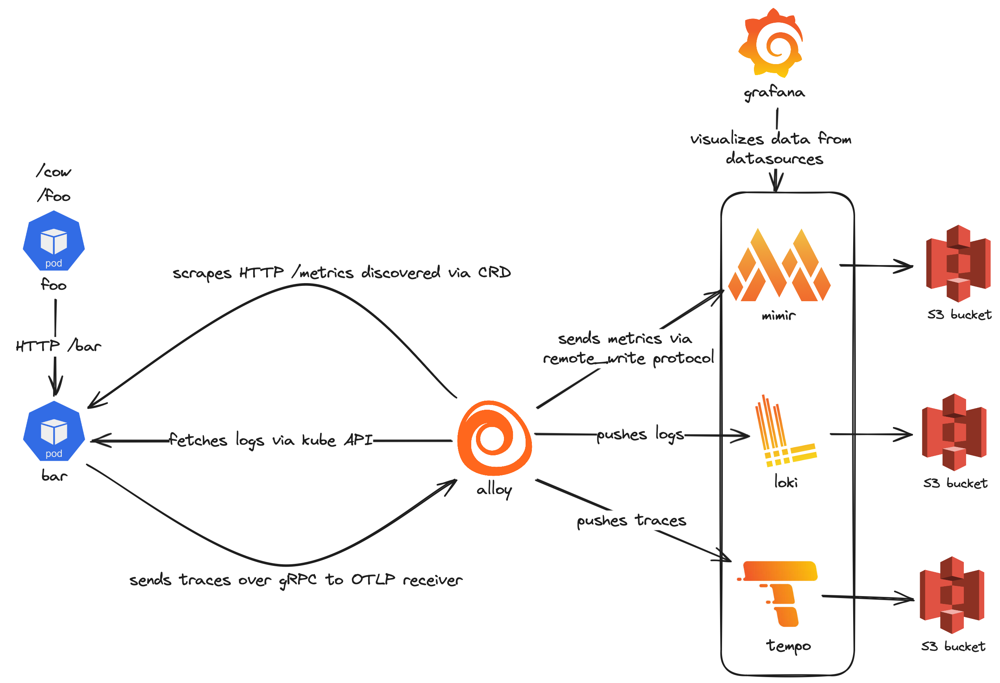
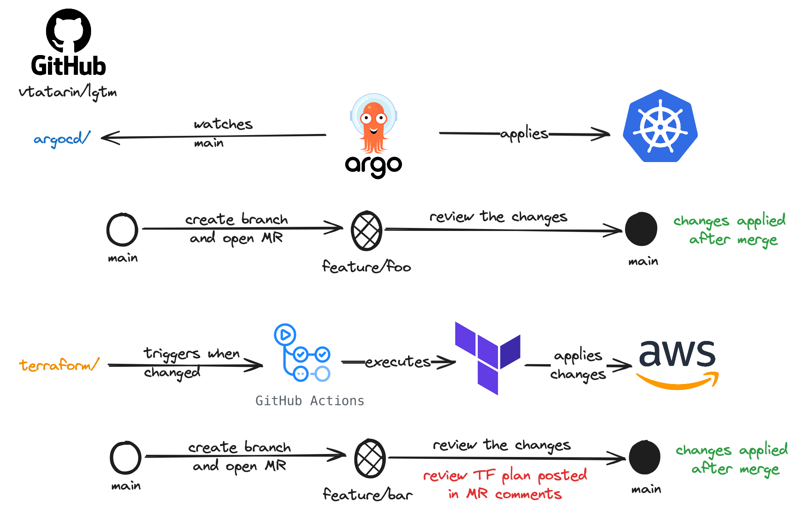

# LGTM

Grafana LGTM (Loki, Grafana, Tempo, Mimir) + Alloy observability stack setup on top of EKS. Provisioned following GitOps with ArgoCD and Terraform integrated with GitHub Actions CI/CD.

**Data Flow Overview**


**CI/CD Overview**


## How-to's

### Access the stack

- https://grafana.sandbox.lgtm.vtatarin.xyz (credentials are stored in AWS Secrets Manager)
- https://argocd.sandbox.lgtm.vtatarin.xyz (credentials are stored in AWS Secrets Manager)
- https://foo.sandbox.lgtm.vtatarin.xyz/foo
- https://foo.sandbox.lgtm.vtatarin.xyz/cow
- https://bar.sandbox.lgtm.vtatarin.xyz/bar

### Contribute

- [Install pre-commit](https://pre-commit.com/#installation)
- Initialize pre-commit hooks
```bash
pre-commit install
```

## DevOps processes in this project

- Infrastructure as Code
- GitOps (ArgoCD)
- CI/CD (Github Actions)
  - pre-commit hooks validate Terraform code
- Centralized observability

## Technology decision points

This project relies on community-driven CNCF tools to ensure stability in development and support. Also, no licensing fees help to reduce the costs

### Terraform

Terraform is the leading IaC tool that allows us to define and provision infrastructure using a simple configuration language. It supports multiple cloud providers and has a large community of contributors. Also, it has a wide selection of ready-to-use AWS modules.

### GitHub, GHA

GitHub is the most popular Git repository hosting service. It has a wide selection of integrations and the largest community. GitHub Actions is a CI/CD tool that is tightly integrated with GitHub, has a free tier for public repositories, and has a wide selection of ready-to-use actions.

### ArgoCD

ArgoCD is a declarative, GitOps continuous delivery tool for Kubernetes. Its direct competitor is FluxCD. However, FluxCD's further development is uncertain due to the shutdown of Weaveworks- its main sponsor ([Gitlab should continue the support](https://about.gitlab.com/blog/2024/03/05/the-continued-support-of-fluxcd-at-gitlab/)).

### EKS + addons

I tend to choose managed services from cloud providers to reduce the operational overhead, thus EKS is a great choice. It is provisioned with a minimal set of addons to reduce the operational complexity and move configuration towards k8s-centric development.

- [ebs-csi-driver](https://github.com/kubernetes-sigs/aws-ebs-csi-driver) (EBS-backed volumes for stateful applications)
- [aws-load-balancer-controller](https://github.com/kubernetes-sigs/aws-load-balancer-controller) (AWS-native load balancer controller)
- [karpenter](https://github.com/awslabs/karpenter) (AWS-recommended autoscaler)
- [external-dns](https://github.com/kubernetes-sigs/external-dns) (DNS records management. Removes the need to manage Route53 records via Terraform which is often painful because of the dynamic nature of load balancer DNS names)

### Observability

[Alloy](https://grafana.com/oss/alloy/) is used as a monitoring data collector. It replaces Grafana Agent, supports various integrations. However, it is quite fresh yet. Documentation is not that good and the community is not that big.

# New cluster deployment

## EKS cluster and related resources

- Add new environment to `terraform/environments` directory and add it as workspace in the [CI/CD pipeline](.github/workflows/terraform.yaml#L23).
- Review output of the `terraform plan` posted as a comment in your PR and merge it to deploy the cluster

## Applications

Current ArgoCD deployment may serve as the control plane for the new cluster. You need to add a new cluster and config files.

- add [new cluster as Secret](https://argo-cd.readthedocs.io/en/stable/operator-manual/declarative-setup/#clusters) in the [argocd/templates](argocd/apps/argocd/templates) directory
- create new or update `applicationset-apps.yaml` in `argocd/templates/applicationset-apps.yaml` to include the new cluster and its customized `values.yaml` via [matrix generator]
(https://argo-cd.readthedocs.io/en/stable/operator-manual/applicationset/Generators-Matrix/)
- add customized `values.yaml` for the components where necessary
- configure Grafana datasources


# Pitfalls
- Grafana Alloy is quite fresh and has limited documentation, lots of issues are filed across LGTM repos to update the configuration references. You may face issues with the configuration and integrations


# TODO
- Add cost management tools to monitor the costs of the infrastructure ([OpenCost](https://www.opencost.io) or [AWS Split Cost Allocation Data](https://aws.amazon.com/about-aws/whats-new/2024/04/aws-split-cost-allocation-data-amazon-eks/))
- Cost optimization
  - Consider merging ALBs into a single one with multiple listeners
- [Enable CoreDNS autoscaling](https://aws.amazon.com/about-aws/whats-new/2024/05/amazon-eks-native-support-autoscaling-coredns-pods/)
- Enable VPC endpoints:
  - S3
  - ECR
  - SSM
- OTEL
  - Refactor `foo` and `bar` applications to use automatic instrumentation instead of manual
- Grafana
  - Cover data sources configuration with code
- Alloy
  - Introduce `DaemnoSet` for log collection via `/var/log` to reduce K8S API load
- ArgoCD
  - Migrate `argocd/templates` to [argocd-apps](https://github.com/argoproj/argo-helm/blob/main/charts/argocd-apps/values.yaml) chart
  - Add matrix generator to better support multiple clusters with customized per-cluster values
- Terraform CI/CD
  - Replace scripts with a proper solution like [Atlantis](https://www.runatlantis.io/) or [Spacelift](https://spacelift.io/)
